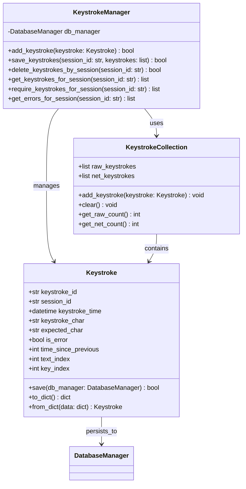

# Keystroke Requirements Specification

## 1. Main Objective

**Purpose**: Record and manage individual keystrokes during typing practice sessions to enable detailed analytics, error reporting, and performance analysis.

**Scope**: Covers keystroke data capture, storage, retrieval, and timing analysis for typing training applications.

## 2. User Stories & Use Cases

### User Needs
- **Learners**: Need detailed feedback on typing accuracy and speed patterns
- **Instructors**: Require analytics to identify student weaknesses and progress
- **System**: Must capture precise timing and sequencing for n-gram analysis

### Use Cases
- **Real-time Capture**: Record each keystroke during practice sessions
- **Performance Analysis**: Calculate typing speed, accuracy, and improvement trends
- **Error Pattern Detection**: Identify common mistakes and problem areas
- **Session Replay**: Reconstruct typing sessions for review and analysis

## 3. Functional Requirements

### 3.1 Data Model
- **keystroke_id**: UUID String (Primary Key)
- **session_id**: UUID String (Foreign Key to practice_sessions)
- **keystroke_time**: DateTime (Timestamp when key was pressed)
- **keystroke_char**: String (Actual character typed)
- **expected_char**: String (Character that should have been typed)
- **is_error**: Boolean (Whether keystroke was incorrect)
- **time_since_previous**: Integer (Milliseconds since previous keystroke, -1 for first keystroke)
- **text_index**: Integer (Position in expected text, 0-based)
- **key_index**: Integer (Sequential order of keystroke in session, 0-based)

### 3.2 Field Specifications

#### Key Index Details
The **key_index** field captures the exact chronological order of every key press:
- **Purpose**: Provides precise sequencing for keystroke analysis and replay functionality
- **Behavior**: Increments by 1 for each key press, regardless of correctness
- **Start Value**: 0 (first key pressed gets key_index = 0)
- **Scope**: Per session - resets to 0 for each new typing session
- **Example**: In typing "hello", keystrokes have key_index values 0, 1, 2, 3, 4 respectively

#### Time Since Previous Details
The **time_since_previous** field stores inter-keystroke timing:
- **Purpose**: Enables calculation of typing rhythm and speed variations
- **Calculation**: Current keystroke_time minus previous keystroke_time (in milliseconds)
- **First Keystroke**: Always set to -1 (no previous keystroke exists to measure from)
- **Subsequent Keystrokes**: Positive integer representing milliseconds since previous keystroke
- **Usage**: Used by KeystrokeCollection for timing analysis and n-gram duration calculations
- **Analytics Note**: When analyzing timing patterns, filter out keystrokes with time_since_previous = -1

### 3.3 Core Functions
- **Real-time Recording**: Capture keystrokes during practice sessions with precise timing
- **Sequential Ordering**: Assign unique key_index for chronological reconstruction
- **Error Classification**: Determine correctness by comparing expected vs actual characters
- **Timing Analysis**: Calculate inter-keystroke intervals for performance metrics

## 4. Non-Functional Requirements

### 4.1 Performance
- **Real-time Capture**: Keystroke recording must not introduce noticeable input lag
- **Storage Efficiency**: Batch operations for bulk keystroke saves
- **Query Performance**: Session keystroke retrieval optimized for analytics

### 4.2 Security
- **SQL Injection Prevention**: All database operations use parameterized queries
- **Data Validation**: All keystroke fields validated before persistence
- **Input Sanitization**: Character data sanitized to prevent malicious input

### 4.3 Reliability
- **Data Integrity**: Keystrokes must be captured without loss during sessions
- **Error Recovery**: System continues functioning if individual keystroke saves fail
- **Consistency**: key_index and timing fields maintain sequential integrity

## 5. Data Model & Design

### 5.1 Database Schema (session_keystrokes table)
```sql
CREATE TABLE session_keystrokes (
    keystroke_id TEXT PRIMARY KEY,
    session_id TEXT NOT NULL,
    keystroke_time TEXT NOT NULL,
    keystroke_char TEXT NOT NULL,
    expected_char TEXT NOT NULL,
    is_error INTEGER NOT NULL,
    time_since_previous INTEGER,
    text_index INTEGER NOT NULL,
    key_index INTEGER NOT NULL,
    FOREIGN KEY (session_id) REFERENCES practice_sessions(session_id) ON DELETE CASCADE
);
```

### 5.2 Field Constraints
- **keystroke_id**: UUID format, unique across all keystrokes
- **session_id**: UUID format, must reference valid practice session
- **keystroke_time**: ISO datetime format with timezone
- **keystroke_char**: Single character or special key representation
- **expected_char**: Single character from practice text
- **is_error**: 0 (correct) or 1 (incorrect)
- **time_since_previous**: Positive integer in milliseconds, or -1 for first keystroke
- **text_index**: Non-negative integer, position in expected text
- **key_index**: Non-negative integer, unique within session

## 6. Acceptance Criteria

### 6.1 Core Functionality
- **Keystroke Persistence**: All keystrokes for a session must be retrievable through `KeystrokeManager.get_keystrokes_for_session(session_id)` in chronological order
- **Session Replacement**: Re-saving keystrokes for an existing session must replace prior records completely
- **Error Handling**: `KeystrokeManager.require_keystrokes_for_session(session_id)` must raise `LookupError` when no keystrokes exist
- **Deletion Success**: `delete_keystrokes_by_session(session_id)` must succeed regardless of whether records exist

### 6.2 Data Integrity
- **Sequential Ordering**: key_index values must be sequential and unique within each session
- **Timing Accuracy**: time_since_previous must accurately reflect milliseconds between keystrokes, with -1 for first keystroke
- **Character Validation**: keystroke_char and expected_char must be valid Unicode characters
- **Error Classification**: is_error field must correctly reflect character comparison results

### 6.3 Performance Criteria
- **Response Time**: Keystroke recording operations must complete within 10ms
- **Batch Operations**: Bulk keystroke saves must handle 1000+ keystrokes efficiently
- **Query Speed**: Session keystroke retrieval must complete within 100ms for typical sessions

## 7. Integration & Interoperability

### 7.1 API Endpoints
- **POST /api/keystrokes**: Record individual keystroke with validation
- **GET /api/keystrokes?session_id=<id>**: Retrieve all keystrokes for session

### 7.2 Internal Integration
- **KeystrokeCollection**: Manages keystroke timing calculations and storage
- **NGramManager**: Consumes keystroke data for n-gram analysis
- **SessionManager**: Links keystrokes to practice sessions

## 8. Analytics Use Cases

### 8.1 Performance Analysis
- **Typing Speed Over Time**: Calculate WPM at different drill points using key_index
- **Rhythm Analysis**: Use time_since_previous for typing pattern detection (excluding first keystroke with -1 value)
- **Fatigue Detection**: Analyze performance degradation over keystroke sequence

### 8.2 Error Pattern Analysis  
- **Error Clustering**: Identify error bursts using sequential key_index values
- **Recovery Time**: Measure correction speed using timing data
- **Problem Areas**: Map errors to text_index positions for targeted practice

## 9. UML Class Diagram



## 10. Constraints & Assumptions

### 10.1 Technical Constraints
- **Database**: SQLite for local storage, PostgreSQL for production
- **Character Encoding**: UTF-8 support for international characters
- **Timing Precision**: Millisecond-level accuracy for keystroke timing
- **Storage Limits**: Sessions limited to reasonable keystroke counts (< 10,000)

### 10.2 Assumptions
- **System Clock**: Accurate system time for keystroke timestamps
- **Input Method**: Standard keyboard input through typing interface
- **Session Integrity**: Practice sessions exist before keystroke recording
- **Unicode Support**: Platform supports Unicode character comparison

## 11. Glossary

- **Keystroke**: Individual key press event during typing practice
- **key_index**: Sequential order number of keystrokes within a session
- **text_index**: Position of expected character in practice text
- **time_since_previous**: Milliseconds elapsed since previous keystroke
- **is_error**: Boolean indicating whether keystroke matched expected character
- **Session**: Practice session containing multiple keystrokes for analysis
