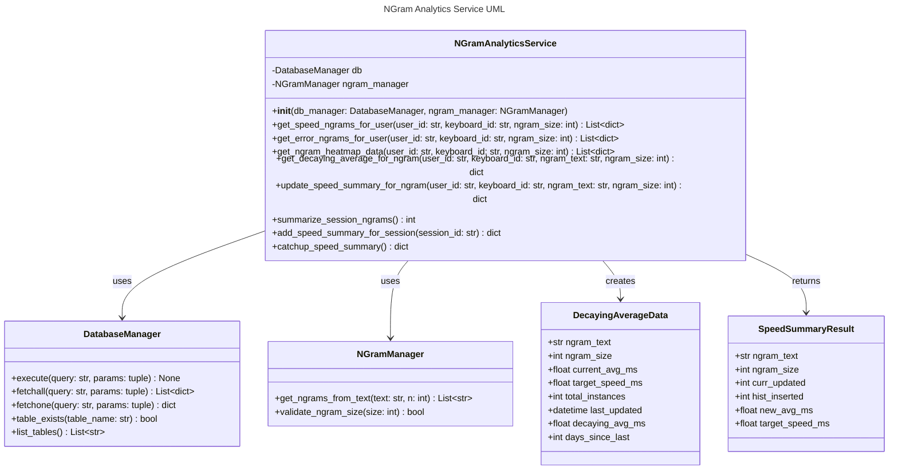
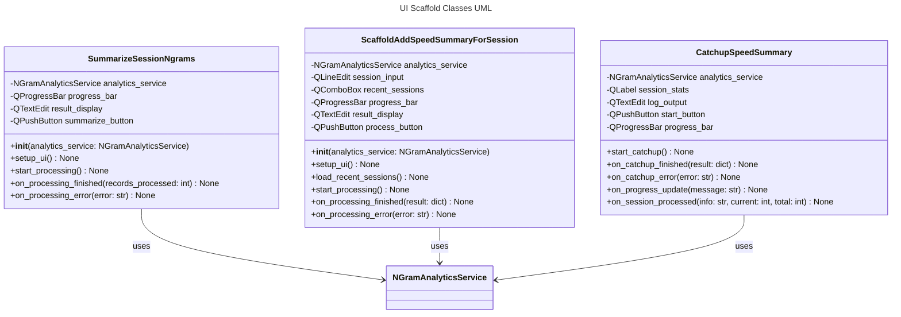
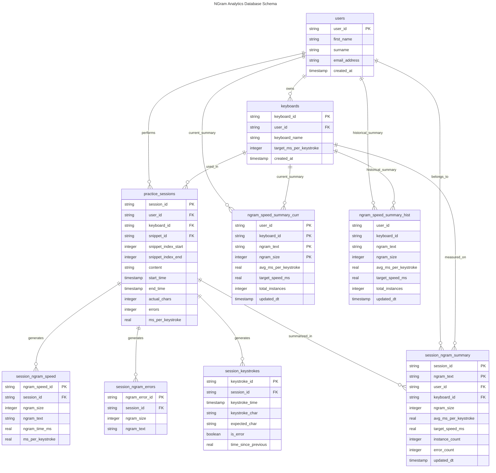
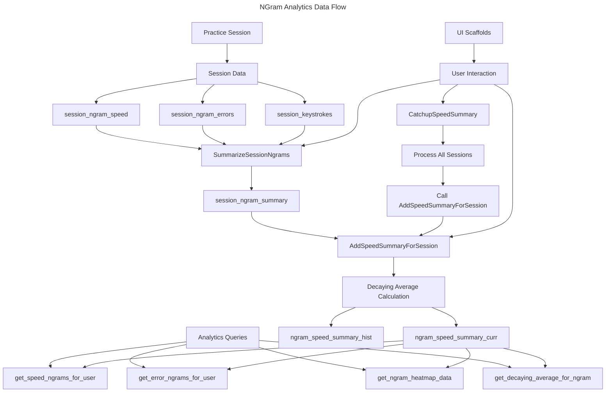

# NGram Analytics Service Specification

## Overview
The `NGramAnalyticsService` provides comprehensive analytics and performance analysis for n-gram typing performance. It implements a decaying average algorithm for recent performance weighting, maintains performance summaries with historical tracking, and provides heatmap data for visualization.

## Key Features
- **Decaying Average Algorithm**: ELO-like system where recent measurements have exponentially higher weights
- **Performance Summaries**: Cached summary table for fast heatmap queries
- **Historical Analysis**: Track performance trends over time
- **Analytics Migration**: Moved `slowest_n` and `error_n` methods from `NGramManager`
- **Heatmap Data**: Formatted data for UI visualization with color coding

## Decaying Average Algorithm
The decaying average algorithm uses exponential weighting to give more importance to recent performance measurements:

```
weight = decay_factor ^ (days_ago)
```

Where:
- `decay_factor` = 0.9 (configurable)
- `days_ago` = number of days since the most recent measurement
- Only the most recent 20 measurements are considered
- More recent measurements receive exponentially higher weights

### Example
For measurements [100ms, 200ms, 300ms] taken [3 days ago, 2 days ago, today]:
- Today's measurement (300ms) gets weight: 0.9^0 = 1.0
- 2 days ago (200ms) gets weight: 0.9^2 = 0.81
- 3 days ago (100ms) gets weight: 0.9^3 = 0.729

Final weighted average = (1.0×300 + 0.81×200 + 0.729×100) / (1.0 + 0.81 + 0.729)

## Data Models

### NGramPerformanceData
Core performance metrics for an n-gram:
- `ngram_text`: The n-gram text (1-50 chars)
- `ngram_size`: Size of the n-gram (1-20)
- `decaying_average_ms`: Weighted average performance in milliseconds
- `target_performance_pct`: Percentage of target performance achieved
- `sample_count`: Number of measurements included
- `last_measured`: Timestamp of most recent measurement
- `performance_category`: "green", "amber", or "grey"

### NGramHeatmapData
Extended data for heatmap visualization:
- All fields from `NGramPerformanceData`
- `decaying_average_wpm`: Performance in words per minute
- `color_code`: Hex color code for visualization

### NGramSummaryData
Database model for cached summaries:
- `summary_id`: UUID primary key
- `user_id`: User identifier
- `keyboard_id`: Keyboard identifier
- `ngram_text`: The n-gram text
- `ngram_size`: Size of the n-gram
- `decaying_average_ms`: Weighted average performance
- `target_speed_ms`: Target speed for this keyboard
- `target_performance_pct`: Performance percentage
- `meets_target`: Boolean indicating if target is met
- `sample_count`: Number of measurements
- `updated_dt`: High-precision datetime of last update

### NGramHistoricalData
Database model for historical performance tracking:
- `history_id`: UUID primary key
- `user_id`: User identifier
- `keyboard_id`: Keyboard identifier
- `ngram_text`: The n-gram text
- `ngram_size`: Size of the n-gram
- `decaying_average_ms`: Weighted average performance at time of measurement
- `target_speed_ms`: Target speed for this keyboard
- `target_performance_pct`: Performance percentage at time of measurement
- `meets_target`: Boolean indicating if target was met
- `sample_count`: Number of measurements used in calculation
- `updated_dt`: High-precision datetime when this measurement was taken

## Database Schema

### ngram_speed_summary_curr Table
```sql
CREATE TABLE IF NOT EXISTS ngram_speed_summary_curr (
    summary_id TEXT PRIMARY KEY,
    user_id TEXT NOT NULL,
    keyboard_id TEXT NOT NULL,
    ngram_text TEXT NOT NULL,
    ngram_size INTEGER NOT NULL,
    decaying_average_ms REAL NOT NULL,
    target_speed_ms REAL NOT NULL,
    target_performance_pct REAL NOT NULL,
    meets_target BOOLEAN NOT NULL,
    sample_count INTEGER NOT NULL,
    updated_dt TEXT NOT NULL,  -- TIMESTAMP(6) for PostgreSQL
    FOREIGN KEY (user_id) REFERENCES users(user_id) ON DELETE CASCADE,
    FOREIGN KEY (keyboard_id) REFERENCES keyboards(keyboard_id) ON DELETE CASCADE,
    UNIQUE (user_id, keyboard_id, ngram_text, ngram_size)
);
```

### Indexes
- `idx_ngram_summary_curr_user_keyboard`: On (user_id, keyboard_id)
- `idx_ngram_summary_curr_performance`: On (target_performance_pct, meets_target)

### ngram_speed_summary_hist Table
```sql
CREATE TABLE IF NOT EXISTS ngram_speed_summary_hist (
    history_id TEXT PRIMARY KEY,
    user_id TEXT NOT NULL,
    keyboard_id TEXT NOT NULL,
    ngram_text TEXT NOT NULL,
    ngram_size INTEGER NOT NULL,
    decaying_average_ms REAL NOT NULL,
    target_speed_ms REAL NOT NULL,
    target_performance_pct REAL NOT NULL,
    meets_target BOOLEAN NOT NULL,
    sample_count INTEGER NOT NULL,
    updated_dt TEXT NOT NULL,  -- TIMESTAMP(6) for PostgreSQL
    FOREIGN KEY (user_id) REFERENCES users(user_id) ON DELETE CASCADE,
    FOREIGN KEY (keyboard_id) REFERENCES keyboards(keyboard_id) ON DELETE CASCADE
);
```

### History Table Indexes
- `idx_ngram_summary_hist_user_keyboard`: On (user_id, keyboard_id)
- `idx_ngram_summary_hist_ngram`: On (ngram_text, ngram_size)
- `idx_ngram_summary_hist_date`: On (updated_dt)

## Core Methods

### refresh_speed_summaries(user_id, keyboard_id)
Recalculates decaying averages and updates the summary table from raw session data using a **dual-insert approach** for historical tracking.

**Dual-Insert Process:**
1. Get target speed from keyboard settings
2. Query recent session ngrams (last 20 measurements)
3. Calculate decaying average for each unique ngram
4. **Dual-insert each summary record:**
   - Insert/replace into `ngram_speed_summary_curr` (current data)
   - Insert into `ngram_speed_summary_hist` (historical record)
5. Calculate performance percentages and target achievement
6. Generate timestamps for both current and historical records

### get_heatmap_data(user_id, keyboard_id, size_filter, sort_by, reverse_sort)
Returns formatted heatmap data with color coding and performance metrics.

**Parameters:**
- `size_filter`: Filter by ngram size (optional)
- `sort_by`: Sort criterion (wpm, accuracy, etc.)
- `reverse_sort`: Sort direction

**Returns:** List of NGramHeatmapData with color codes

### get_ngram_history(user_id, keyboard_id, ngram_text=None)
Returns historical performance data for trend analysis and improvement tracking.
### slowest_n(n, keyboard_id, user_id, ngram_sizes=None, included_keys=None, min_occurrences=5, focus_on_speed_target=False)
Returns the n slowest n-grams using decaying averages from the summary table.

**Behavior:**
- Queries `ngram_speed_summary_curr` only (no session lookback filtering).
- All filtering is performed in SQL:
  - Filter by `user_id`, `keyboard_id`.
  - Optional `ngram_sizes` via `IN` list.
  - Optional `included_keys` via nested `REPLACE()` allowing only specified characters.
  - `sample_count >= min_occurrences`.
  - When `focus_on_speed_target=True`, restrict to `meets_target = 0` (slower than target).
- Results ordered by `decaying_average_ms DESC` (slowest first).
- Returns a list of `NGramStats` with `avg_speed` and `ngram_score` set to `decaying_average_ms`.

**Parameters:**
- `n` (int): Number of results to return.
- `keyboard_id` (str): Keyboard to filter.
- `user_id` (str): User to filter.
- `ngram_sizes` (Optional[List[int]]): Allowed n-gram sizes.
- `included_keys` (Optional[List[str]]): Whitelist of characters; only n-grams composed of these are returned.
- `min_occurrences` (int): Minimum `sample_count` required (default 5).
- `focus_on_speed_target` (bool): If true, only include n-grams not meeting target speed.

### error_n(n, keyboard_id, user_id, options)
Returns the n most error-prone n-grams.

**Moved from NGramManager with improvements:**
- Uses recent session data
- Maintains same interface for compatibility

## Historical Tracking Architecture

### Dual-Insert Strategy
The service implements a **dual-insert approach** for comprehensive historical tracking:

- **Current Summary Table** (`ngram_speed_summary_curr`): Maintains latest performance metrics
- **History Table** (`ngram_speed_summary_hist`): Accumulates all historical measurements
- **Simultaneous Inserts**: Every refresh operation writes to both tables
- **No Data Movement**: History records are never moved or deleted, only accumulated

### Benefits of Dual-Insert
- **Performance**: No expensive data migration operations
- **Simplicity**: Straightforward insert operations only
- **Reliability**: No risk of data loss during moves
- **Query Efficiency**: Optimized tables for different access patterns
- **Historical Integrity**: Complete audit trail of all measurements

### Data Flow
```
Session Data → refresh_speed_summaries() → ┌─ INSERT/REPLACE → ngram_speed_summary_curr
                                          └─ INSERT → ngram_speed_summary_hist
```

## Performance Optimization
- **Summary Table**: Pre-calculated metrics for fast queries
- **History Table**: Separate optimized storage for time-series data
- **Indexes**: Optimized for common query patterns
- **Batch Processing**: Efficient summary refresh
- **Parameterized Queries**: Prevents SQL injection
- **Dual-Insert Efficiency**: Minimal overhead for historical tracking

## Error Handling
- Graceful handling of missing keyboard data
- Validation of input parameters
- Proper exception logging
- Fallback to empty results on errors

## Testing Requirements
- Unit tests for all methods
- Integration tests with temporary database
- Edge case testing (empty data, invalid parameters)
- Performance tests for large datasets
- Decaying average calculation validation

## UI Integration
The service provides data for:
- **Heatmap Grid**: Visual performance overview
- **Filtering**: Size, performance, sort options
- **Color Coding**: Immediate visual feedback
- **WPM Display**: User-friendly speed metrics

## Migration Notes
When migrating from NGramManager:
1. Update imports to use NGramAnalyticsService
2. Call `refresh_speed_summaries()` before analytics queries
3. Update callers of `slowest_n()` to remove the deprecated `lookback_distance` parameter. All filtering is now SQL-based on the summary table.
4. Both summary and history tables are created automatically during database initialization
5. Historical data accumulates automatically from first refresh operation
6. Use `get_ngram_history()` for trend analysis and historical performance tracking

## New Session-Level Analytics Methods

### SummarizeSessionNgrams
Summarizes ngram performance for all sessions not yet processed in `session_ngram_summary`.

**Purpose**: Aggregate raw session data into summary format for downstream analytics

**Process**:
1. **MissingSessions CTE**: Finds sessions not in `session_ngram_summary`
2. **SessionSpeedSummary CTE**: Aggregates speed data from `session_ngram_speed`
3. **AddErrors CTE**: Left joins error data from `session_ngram_errors`
4. **AddKeys CTE**: Processes individual keystrokes as 1-grams
5. **AllNgrams CTE**: Unions speed/error data with keystroke data
6. **ReadyToInsert CTE**: Final data preparation and filtering
7. **Bulk Insert**: Inserts all prepared data into `session_ngram_summary`

**Returns**: Number of records inserted

**Tables Used**:
- `practice_sessions` (source sessions)
- `keyboards` (target speed lookup)
- `session_ngram_speed` (speed measurements)
- `session_ngram_errors` (error counts)
- `session_keystrokes` (individual keystroke timing)
- `session_ngram_summary` (destination table)

### AddSpeedSummaryForSession
Updates performance summaries for a specific session using decaying average calculation.

**Purpose**: Calculate weighted performance metrics using the last 20 sessions

**Process**:
1. **SessionContext CTE**: Gets target session details and target speed
2. **Recent20Sessions CTE**: Finds 20 most recent sessions up to target session
3. **NgramPerformanceData CTE**: Joins session data with performance metrics
4. **DecayingAverages CTE**: Applies exponential weighting (0.9^days_ago)
5. **Dual Insert**: Updates `ngram_speed_summary_curr` (merge) and `ngram_speed_summary_hist` (insert)

**Parameters**:
- `session_id`: The session to process

**Returns**: Dictionary with `hist_inserted` and `curr_updated` counts

**Decaying Average Formula**:
```
weighted_avg = SUM(value * count * 0.9^days_ago) / SUM(count * 0.9^days_ago)
```

**Tables Updated**:
- `ngram_speed_summary_curr` (current performance state)
- `ngram_speed_summary_hist` (historical tracking)

### CatchupSpeedSummary
Processes all sessions chronologically to build complete performance history.

**Purpose**: Batch process all sessions to catch up analytics from scratch

**Process**:
1. Query all sessions ordered by `start_time ASC`
2. For each session:
   - Log session info (ID, avg speed, datetime)
   - Call `AddSpeedSummaryForSession`
   - Log record counts (indented debug output)
   - Continue on errors to process remaining sessions
3. Return summary statistics

**Returns**: Dictionary with total counts and processing summary

**Debug Output Format**:
```
Processing session abc123..., avg speed: 150.5ms, datetime: 2024-01-15 10:30:00
    Records: 25 updated in curr, 25 inserted in hist
Processing session def456..., avg speed: 140.2ms, datetime: 2024-01-15 11:15:00
    Records: 23 updated in curr, 23 inserted in hist
```

## Session Ngram Summary Table
New table `session_ngram_summary` stores session-level ngram performance:

**Schema**:
```sql
CREATE TABLE session_ngram_summary (
    session_id TEXT NOT NULL,
    ngram_text TEXT NOT NULL,
    user_id TEXT NOT NULL,
    keyboard_id TEXT NOT NULL,
    ngram_size INTEGER NOT NULL,
    avg_ms_per_keystroke REAL NOT NULL,
    target_speed_ms REAL NOT NULL,
    instance_count INTEGER NOT NULL,
    error_count INTEGER NOT NULL,
    updated_dt TEXT NOT NULL,
    PRIMARY KEY (session_id, ngram_text)
);
```

**Indexes**:
- `idx_session_ngram_summary_session`: On (session_id)
- `idx_session_ngram_summary_user_keyboard`: On (user_id, keyboard_id)
- `idx_session_ngram_summary_ngram`: On (ngram_text, ngram_size)

## UI Scaffold Forms
Three new UI forms provide easy access to the analytics methods:

### SummarizeSessionNgrams
- **File**: `desktop_ui/summarize_session_ngrams.py`
- **Purpose**: Trigger session ngram summarization
- **Features**: Progress bar, result display, background processing

### ScaffoldAddSpeedSummaryForSession
- **File**: `desktop_ui/scaffold_add_speed_summary_for_session.py`
- **Purpose**: Process specific session with session ID input
- **Features**: Recent sessions dropdown, session selection, result breakdown

### CatchupSpeedSummary
- **File**: `desktop_ui/catchup_speed_summary.py`
- **Purpose**: Batch process all sessions with progress logging
- **Features**: Session statistics, real-time log output, confirmation dialogs

## UML Class Diagrams



## UI Scaffold Classes



## Entity Relationship Diagrams



## Data Flow Diagram



## Dependencies
- `pydantic`: Data validation and type checking
- `DatabaseManager`: Database operations
- `NGramManager`: Core n-gram operations
- `sqlite3`/`psycopg2`: Database connectivity
