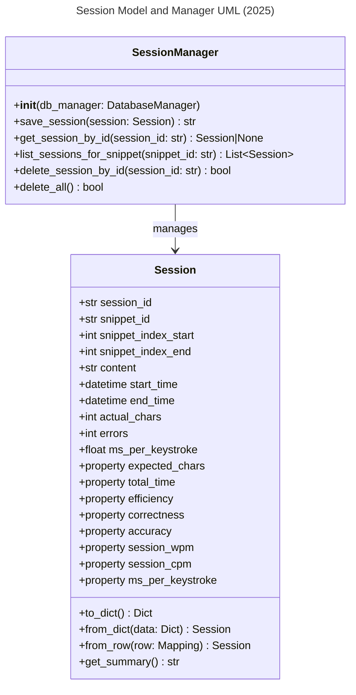

<!-- filepath: d:\OneDrive\Documents\SeanDev\AITypingTrainer\Prompts\Session.md -->
# Session Object Specification

## 1. Overview
A Session records a user's typing practice, including timing, correctness, and analytics. All business logic and validation are in `Session` (`models/session.py`). All DB and aggregate logic are in `SessionManager` (`models/session_manager.py`).

## 2. Data Model

### Database Schema

#### practice_sessions Table
- **session_id**: TEXT PRIMARY KEY (UUID string)
- **snippet_id**: TEXT NOT NULL (Foreign Key to snippets.snippet_id)
- **user_id**: TEXT NOT NULL (Foreign Key to users.user_id)
- **keyboard_id**: TEXT NOT NULL (Foreign Key to keyboards.keyboard_id)
- **snippet_index_start**: INTEGER NOT NULL
- **snippet_index_end**: INTEGER NOT NULL
- **content**: TEXT NOT NULL
- **start_time**: DATETIME NOT NULL
- **end_time**: DATETIME NOT NULL
- **actual_chars**: INTEGER NOT NULL
- **errors**: INTEGER NOT NULL
- **ms_per_keystroke**: REAL NOT NULL
## 3. Functional Requirements
- Sessions are created by instantiating a `Session` (with string UUID `session_id`) and calling `save_session` on `SessionManager`.
- Sessions can be deleted by `delete_session_by_id(session_id)` on `SessionManager`.
- All business logic, validation, and computed properties are in the Session model.
- All DB operations are parameterized and handled by SessionManager.
- Sessions are validated for UUID, time, indices, and error logic.
- All computed metrics (WPM, CPM, efficiency, ms_per_keystroke, etc.) are properties, not stored fields (except ms_per_keystroke, which is also stored in DB for analytics).
- All validation is performed using Pydantic models and validators.
- All code uses type hints and docstrings for clarity and safety.

## 4. Computed Properties (Session)
- **expected_chars**: snippet_index_end - snippet_index_start
- **total_time**: (end_time - start_time).total_seconds()
- **efficiency**: actual_chars / expected_chars
- **correctness**: (actual_chars - errors) / actual_chars
- **accuracy**: correctness * efficiency
- **session_wpm**: (actual_chars / 5) / (total_time / 60)
- **session_cpm**: actual_chars / (total_time / 60)
- **ms_per_keystroke**: (total_time * 1000) / expected_chars (always required, never null; 0.0 if expected_chars is 0)

## 5. API Endpoints
All session management is handled via a unified GraphQL endpoint at `/api/graphql`.

**GraphQL Queries:**
- `sessions(snippet_id: String!)`: List all sessions for a snippet
- `session(session_id: String!)`: Get a specific session by ID

**GraphQL Mutations:**
- `createSession(data: SessionInput!)`: Create a new session
- `updateSession(session_id: String!, data: SessionInput!)`: Update a session
- `deleteSession(session_id: String!)`: Delete a session

All validation errors are surfaced as GraphQL error responses with clear, specific messages.

## 6. UI Requirements
- Session analytics and management available in both desktop (PyQt5) and web UIs
- Session details, metrics, and summaries are shown in the UI
- Add/Edit/Delete dialogs must validate input and show clear errors

## 7. Testing
- Backend, API, and UI tests must cover all CRUD operations, validation, and error handling
- All tests must run on a clean DB and be independent
- All computed properties and business rules are tested

## 8. Security/Validation
- No SQL injection (parameterized queries)
- No sensitive data hardcoded
- All user input is validated and sanitized

## 9. Code Quality, Testing, and Security Standards
- All code is formatted with Black and follows PEP 8 style guidelines.
- Linting is enforced with flake8; all lint errors are fixed before merging.
- All code uses type hints and Pydantic for validation.
- All tests use pytest and pytest fixtures for setup/teardown, with DB isolation.
- No test uses the production DB; all tests are independent and parameterized.
- All Session CRUD operations, validation, and error handling are covered by backend, API, and UI tests.
- No sensitive data is hardcoded. All user input is validated and sanitized.
- All database operations use parameterized queries for security.

---

## 10. API Implementation and Structure
- All Session API operations are implemented in `api/session_api.py` and `api/session_graphql.py` using Graphene and Flask.
- The GraphQL schema defines types, queries, and mutations with proper validation.
- All business logic (creation, update, deletion, DB access) is handled in `models/session.py` and `models/session_manager.py`.
- The unified endpoint `/api/graphql` handles all operations.
- Error handling and status codes follow GraphQL conventions.
- Type hints and docstrings document all components.

---

## 11. UML Class Diagram (Refreshed June 2025)

