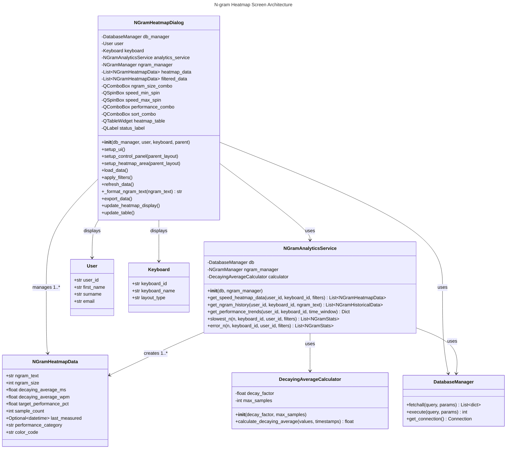

# N-gram Speed Heatmap Screen Specification

## 1. Overview

The N-gram Speed Heatmap Screen provides a comprehensive visualization of n-gram typing performance data through an interactive heatmap interface. This desktop UI screen allows users to analyze their typing speed patterns, identify problematic n-grams, and track performance improvements over time. The screen features advanced filtering, sorting, and export capabilities for detailed performance analysis.

## 2. Data Model

### Core Data Structures

#### NGramHeatmapData
The primary data model for heatmap visualization, sourced from the `NGramAnalyticsService`:

- **ngram_text**: str (1-50 chars) - The n-gram text with visible character formatting
- **ngram_size**: int (1-20) - Size of the n-gram (number of characters)
- **decaying_average_ms**: float (≥0.0) - Weighted average typing speed in milliseconds
- **decaying_average_wpm**: float (≥0.0) - Calculated WPM from millisecond data
- **target_performance_pct**: float (≥0.0) - Performance as percentage of target speed
- **sample_count**: int (≥0) - Number of typing samples for this n-gram
- **last_measured**: Optional[datetime] - Timestamp of most recent measurement
- **performance_category**: str - Color category: "green", "amber", or "grey"
- **color_code**: str - Hex color code for visualization (#RRGGBB format)

### Database Dependencies

The heatmap screen relies on data from several database tables:
- **ngram_speed_summary_curr**: Current performance summaries with decaying averages
- **session_ngram_speed**: Raw speed measurements from typing sessions
- **session_ngram_errors**: Error tracking for n-grams
- **practice_sessions**: Session metadata for user/keyboard filtering

## 3. Functional Requirements

### 3.1 Data Loading and Display

- **Initial Load**: Automatically loads heatmap data for the current user and keyboard on screen initialization
- **Real-time Refresh**: Data automatically refreshes from database whenever filter settings change
- **Performance Categorization**: N-grams are categorized into performance levels:
  - **Green (Excellent)**: Meeting or exceeding target performance
  - **Amber (Average)**: Below target but within acceptable range
  - **Grey (Poor)**: Significantly below target performance
- **Visual Character Formatting**: Special characters are displayed with visible representations:
  - Space characters: `␣` (visible space symbol)
  - Newline characters: `↵` (return arrow symbol)

### 3.2 Filtering and Sorting

- **N-gram Size Filter**: Filter by specific n-gram sizes (1-5 characters) or show all
- **Speed Range Filter**: Filter by typing speed range in milliseconds (0-2000ms)
- **Performance Level Filter**: Filter by performance categories (All, Excellent, Good, Average, Poor)
- **Sort Options**: Multiple sorting criteria available:
  - N-gram Text (alphabetical)
  - Speed (by decaying average)
  - Sample Count (by number of measurements)
  - Performance (by category ranking)
- **Auto-refresh**: All filter changes trigger automatic data refresh from database

### 3.3 Data Export

- **CSV Export**: Export filtered heatmap data to CSV format
- **Export Fields**: Includes all relevant data fields:
  - N-gram text, size, average speed, target speed
  - Performance status, sample count, last updated timestamp
- **File Dialog**: Standard file save dialog for export location selection
- **Error Handling**: Comprehensive error handling with user feedback

### 3.4 User Interface Features

- **Modal Dialog**: Heatmap screen opens as a modal dialog over the main application
- **Responsive Layout**: Minimum size 1200x800 pixels with proper component scaling
- **Status Updates**: Real-time status bar showing data counts and operation feedback
- **User Context**: Displays current user name and keyboard information
- **Interactive Table**: Sortable table with color-coded performance indicators

## 4. User Interface Components

### 4.1 Header Section
- **Title**: "N-gram Speed Heatmap" with prominent styling
- **User Info**: Current user's first name and surname
- **Keyboard Info**: Current keyboard name

### 4.2 Control Panel
- **N-gram Size Combo**: Dropdown with options "All", "1", "2", "3", "4", "5"
- **Speed Range Controls**: Min/max spinboxes (0-2000ms range)
- **Performance Filter**: Dropdown with performance level options
- **Sort Options**: Dropdown with sorting criteria

### 4.3 Heatmap Table
- **Columns**:
  1. N-gram Text (with visible character formatting)
  2. Size (n-gram character count)
  3. Average Speed (ms, with numeric sorting)
  4. Sample Count (number of measurements)
  5. Performance Level (text description)
  6. Color Indicator (colored dot symbol)
- **Color Coding**:
  - Green (#4CAF50): Excellent performance
  - Orange (#FFC107): Average performance  
  - Red (#F44336): Poor performance

### 4.4 Action Buttons
- **Refresh Data**: Manual data refresh from database
- **Export Data**: CSV export functionality
- **Close**: Close dialog and return to main application

### 4.5 Status Bar
- **Data Counts**: Shows "Showing X of Y n-grams" with current filter results
- **Operation Status**: Displays loading, success, and error messages

## 5. Technical Implementation

### 5.1 Architecture
- **Framework**: PySide6 (Qt for Python) desktop application
- **Dialog Type**: QDialog with modal behavior
- **Layout**: QVBoxLayout with organized component sections
- **Data Service**: NGramAnalyticsService for data retrieval and processing

### 5.2 Key Dependencies
- **DatabaseManager**: Database connection and query execution
- **NGramAnalyticsService**: Advanced analytics and heatmap data generation
- **NGramManager**: N-gram data management
- **User/Keyboard Models**: Context for data filtering

### 5.3 Data Flow
1. **Initialization**: Load user/keyboard context and initialize analytics service
2. **Data Loading**: Query heatmap data via `get_speed_heatmap_data()` method
3. **Filtering**: Apply user-selected filters to raw data
4. **Display**: Update table with formatted and sorted data
5. **Export**: Generate CSV output from filtered dataset

### 5.4 Performance Considerations
- **Decaying Average**: Uses exponential weighting for recent performance emphasis
- **Efficient Filtering**: Database-level filtering before UI processing
- **Lazy Loading**: Data loaded only when needed
- **Memory Management**: Proper cleanup of large datasets

## 6. API Integration

### 6.1 NGramAnalyticsService Methods
- **get_speed_heatmap_data()**: Primary data retrieval method
  - Parameters: user_id, keyboard_id, optional filters
  - Returns: List[NGramHeatmapData] with performance metrics
- **Decaying Average Calculation**: Weighted performance metrics
- **Performance Categorization**: Automatic color coding based on targets

### 6.2 Data Processing Pipeline
1. **Raw Data Query**: Retrieve n-gram speed and error data
2. **Decaying Average**: Calculate weighted performance metrics
3. **Target Comparison**: Determine performance categories
4. **Color Assignment**: Apply visual coding for heatmap display
5. **Formatting**: Apply visible character representations

## 7. Error Handling and Validation

### 7.1 Data Validation
- **Input Validation**: All filter inputs validated for proper ranges
- **Database Errors**: Comprehensive error handling for database operations
- **Data Integrity**: Validation of retrieved data structures

### 7.2 User Feedback
- **Status Messages**: Clear feedback for all operations
- **Error Dialogs**: Detailed error messages for failures
- **Loading Indicators**: Visual feedback during data operations
- **Export Confirmation**: Success/failure notifications for export operations

## 8. Testing Requirements

### 8.1 Unit Tests
- **Data Loading**: Test heatmap data retrieval and processing
- **Filtering Logic**: Validate all filter combinations
- **Sorting Functionality**: Test all sort options
- **Export Operations**: Verify CSV generation and file operations

### 8.2 Integration Tests
- **Database Integration**: Test with real database connections
- **Service Integration**: Validate NGramAnalyticsService integration
- **UI Integration**: Test complete user workflows

### 8.3 UI Tests
- **Dialog Behavior**: Test modal dialog functionality
- **Filter Interactions**: Validate filter change responses
- **Table Operations**: Test sorting and display updates
- **Export Workflow**: End-to-end export testing

## 9. Security and Performance

### 9.1 Security Measures
- **Parameterized Queries**: All database operations use safe query parameters
- **Input Sanitization**: User inputs validated and sanitized
- **File Operations**: Secure file handling for export functionality
- **Error Information**: Sensitive data excluded from error messages

### 9.2 Performance Optimization
- **Efficient Queries**: Optimized database queries with proper indexing
- **Data Caching**: Appropriate caching of frequently accessed data
- **UI Responsiveness**: Non-blocking operations for data loading
- **Memory Management**: Proper cleanup of large datasets

## 10. Future Enhancements

### 10.1 Planned Features
- **Historical Trends**: Time-based performance trend visualization
- **Comparative Analysis**: Multi-user or multi-keyboard comparisons
- **Advanced Filtering**: More sophisticated filter combinations
- **Custom Targets**: User-defined performance targets

### 10.2 Visualization Improvements
- **True Heatmap**: Grid-based color visualization
- **Performance Charts**: Graphical performance representations
- **Interactive Elements**: Drill-down capabilities for detailed analysis

## 11. UML Class Diagram

## 12. Implementation Notes

### 12.1 Character Formatting
The heatmap screen implements consistent character formatting with the typing drill:
- **Space Character**: `␣` (U+2423 Open Box)
- **Newline Character**: `↵` (U+21B5 Downwards Arrow with Corner Leftwards)

### 12.2 Performance Categories
Performance categorization uses the following logic:
- **Green**: target_performance_pct >= 100%
- **Amber**: target_performance_pct >= 75% and < 100%
- **Grey**: target_performance_pct < 75%

### 12.3 Data Refresh Strategy
The screen implements automatic data refresh on filter changes to ensure users always see current data, improving the user experience by eliminating the need for manual refresh operations.

---

**This specification defines the complete requirements for the N-gram Speed Heatmap Screen, ensuring consistent implementation with the existing AI Typing Trainer architecture and user experience standards.**
